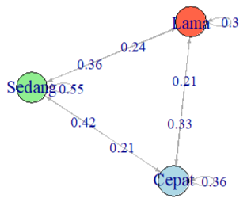
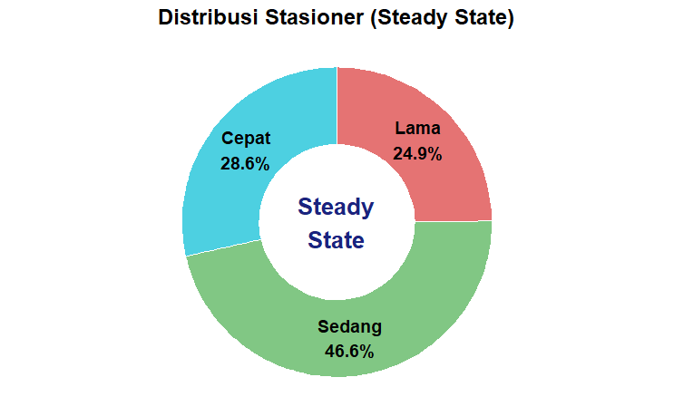

# *Markov Chain Analysis: Thesis Completion Time*
## Pemodelan Stokastik untuk Analisis Waktu Penyelesaian Tugas Akhir Mahasiswa Sains Data

# *Overview*
Repository ini berisi dokumentasi dan kode sumber untuk Tugas Besar mata kuliah Pemodelan Stokastik. Proyek ini bertujuan untuk memodelkan dinamika waktu penyelesaian Tugas Akhir (TA) mahasiswa Program Studi Sains Data ITERA menggunakan pendekatan Rantai Markov (*Markov Chain*).

Kami menganalisis probabilitas transisi durasi pengerjaan antar tahapan:
1. Sempro $\rightarrow$ Semhas (Seminar Proposal ke Seminar Hasil)

2. Semhas $\rightarrow$ Sidang (Seminar Hasil ke Sidang Akhir)

# *Authors* (Kelompok 5)
* 122450012 - Sesilia Putri Subandi
* 122450027 - Raid Muhammad Naufal
* 122450072 - Syadza Puspadari Azhar
* 122450119 - Muhammad Zaky Zaiddan

Dosen Pengampu: Mika Alvionita Sitinjak, M.Si. & Rian Kurnia, S.Si., M.Si.

# *Methodology*

Penelitian ini menggunakan data historis dari Database Tugas Akhir Program Studi Sains Data (N=128). Status durasi diklasifikasikan menggunakan pendekatan Kuartil Data Aktual dengan ketentuan:
* 🟦 Cepat ($X \le Q1$): Durasi penyelesaian sangat singkat (25% tercepat).
* 🟩 Sedang ($Q1 < X \le Q3$): Durasi penyelesaian normal/rata-rata (50% populasi).
* 🟥 Lama ($X > Q3$): Durasi penyelesaian lambat (25% terlama).

#  *Key Findings*
Berdasarkan analisis Matriks Transisi dan Distribusi Stasioner:
## 1. Pola Transisi (*Transition Pattern*)

$$P = \begin{bmatrix}
0.37 & 0.42 & 0.21 \\
0.21 & 0.55 & 0.24 \\
0.33 & 0.37 & 0.30
\end{bmatrix}$$

  
   
  <em>Gambar: Visualisasi probabilitas perpindahan antar kategori waktu.</em>

* Stabilitas Kategori Sedang: Mahasiswa di kategori Sedang memiliki peluang tertinggi (55%) untuk tetap berada di jalurnya.
* Risiko Perlambatan: Mahasiswa yang Cepat di tahap awal memiliki peluang 42% untuk melambat ke kategori Sedang di tahap berikutnya.
* Peluang Perbaikan: Mahasiswa kategori Lama memiliki peluang 33% untuk mengejar ketertinggalan menjadi Cepat.

## 2. Prediksi Jangka Panjang (*Steady State*)

  

Dalam jangka panjang, distribusi waktu penyelesaian TA diprediksi akan konvergen pada proporsi berikut:

| Kategori | Probabilitas (*Steady State*) | Interpretasi | 
 | ----- | ----- | ----- | 
| **Sedang** | **46.56%** | Kondisi paling dominan/stabil | 
| **Cepat** | 28.56% | Minoritas berkinerja tinggi | 
| **Lama** | 24.89% | Minoritas yang mengalami kendala |

*© 2025 Program Studi Sains Data, Institut Teknologi Sumatera*